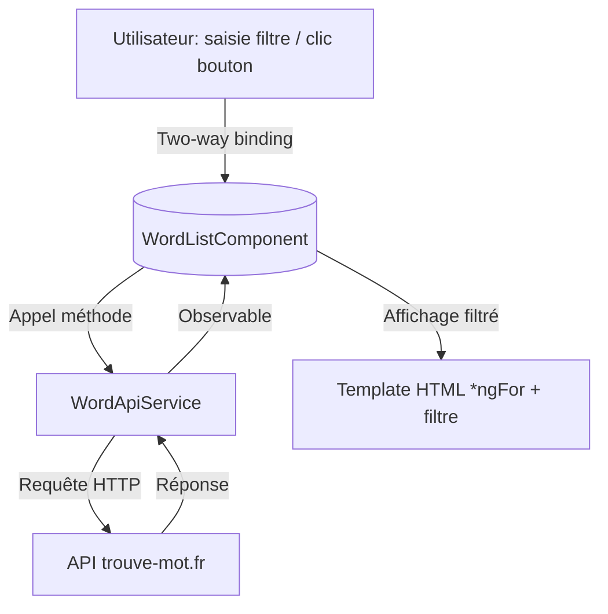
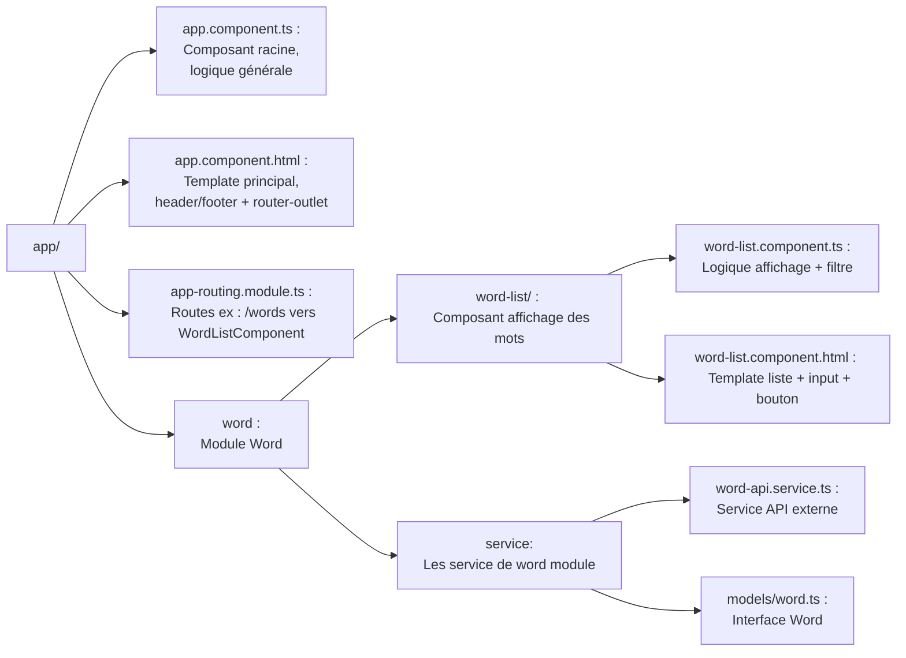
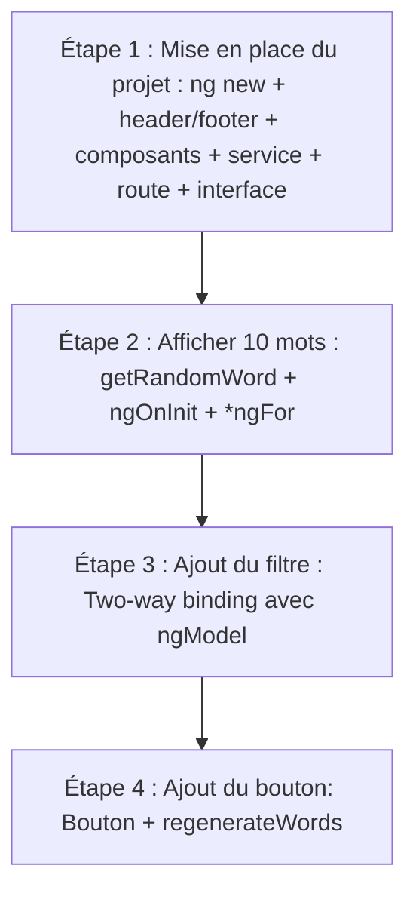

# RAMDOM-WORD-ANGULAR

## TP Angular : mots aléatoires & filtre dynamique (avec schéma)

🎯 **Objectif :**  
Crée une app Angular 20 pour afficher des mots aléatoires grâce à une API, en combinant composants, services, routes et **two-way binding** pour un filtrage en direct.

🌐 **API :** [https://www.trouve-mot.fr](https://www.trouve-mot.fr/)

---

### 💻 Flux des données & interactions (diagramme simplifié)



---

### 📌 Schéma des fichiers de `app/` avec rôle de chacun



---

### 📌 Schéma de progression (flux des étapes)



---

### 🚀 Étape 1 : Mise en place du projet

- `ng new mon-projet` (avec routing)

- Ajoute `header` et `footer`

**Spécifier le chemin `word/component/` dans la commande de génération permet d’organiser la structure du projet dès la création du composant, sans avoir à la modifier par la suite.**
- `ng generate component word/component/word-list`

- `ng generate service word/service/word-api`

- Route `/words`

- Interface exemple : `Word { word: string }` À toi de réaliser l’interface correspondant aux données retournées par le endpoint de génération des mots.

---

### 🚀 Étape 2 : Afficher une liste de 10 mots

- Crée la méthode `getRandomWord()` dans le service pour interroger l’API.

- Dans `word-list.component.ts`, récupère les mots dans `ngOnInit()`.

- Dans `word-list.component.html`, affiche les mots avec :

Explication : let word déclare une variable locale représentant l'élément courant de l'itération sur wordRandomList ; syntaxe Angular pour boucler sur un tableau dans un template.

```html
<ul>
  <li *ngFor="let word of wordRandomList">{{ word.word }}</li>
</ul>
```

---

### 🚀 Étape 3 : Ajout du two-way binding (filtre)

- Dans `word-list.component.ts`, Ajoute un champ `filterText: string = "";`

- Dans le template :

```html
<input [(ngModel)]="filterText" placeholder="Filtrer les mots">
<ul>
  <li *ngFor="let word of wordRandomList | filter: filterText">{{ word.word }}</li>
</ul>
```

---

### 🚀 Étape 4 : Ajout du bouton de régénération

- Dans le template :

```html
<button (click)="regenerateWords()">Nouveaux mots</button>
```

- Dans `word-list.component.ts`, Implémente la méthode `regenerateWords()` pour relancer `getRandomWord()`.

---

## Ressources des étapes

### 🔹 Création du projet

- **Commande :** `ng new mon-projet` (avec routing)

- **Doc :** [Angular CLI - ng new](https://angular.dev/installation#create-a-new-project)

---

### 🔹 Ajout du header et footer

- **Doc :** [Angular - Template Syntax](https://angular.dev/guide/templates)

---

### 🔹 Génération du composant `word-list`

- **Commande :** `ng generate component word-list`

- **Doc :** [Angular CLI - generate component](https://angular.dev/cli/generate/component)

---

### 🔹 Génération du service `word-api`

- **Commande :** `ng generate service word-api`

- **Doc :** [Angular CLI - generate service](https://angular.dev/cli/generate/service)

---

### 🔹 Configuration de la route `/words`

- **Doc :** [Angular - Routing & Navigation](https://angular.dev/guide/routing/define-routes#managing-routes-in-your-application)

---

### 🔹 Déclaration de l’interface `Word`

- **Exemple :** `export interface Word { word: string; }`

- **Doc :** [TypeScript - Interfaces](https://www.typescriptlang.org/docs/handbook/interfaces.html)

---

### 🔹 Méthode `getRandomWord()` dans le service

- **Doc :** [Angular - HttpClient](https://angular.dev/guide/http)

---

### 🔹 Template avec two-way binding et affichage dynamique

- **Exemple :** `<input [(ngModel)]="filterText">`

- **Doc :** [Angular - Forms](https://angular.dev/guide/forms)

- **Doc :** [Angular (*ngFor)](https://angular.dev/api/common/NgFor#description)

---
